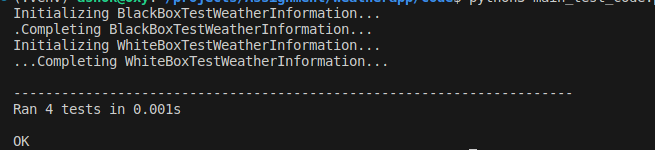
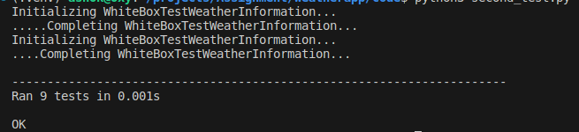

# Malla_Bikram_21413647

## A. Cover Page/Identity Information

- Assessment Name: Introduction to Software Engineering
- Your Name: Bikram Malla
- Curtin Student ID: 21413647
- Practical Class (Date/Time/Venue):

## B. Introduction
This assessment involved the development and testing of a software system focusing on weather information and temperature comparison. The objective was to design and implement modules that would allow users to retrieve weather data for a specific location and type of weather, as well as compare the temperature of a given city with its average temperature.

The assessment was divided into several parts, each addressing different aspects of software engineering. It began with creating module descriptions for the weather information and temperature comparison modules. These descriptions outlined the functionality and purpose of each module, providing a clear understanding of their roles within the software system.

Following the module descriptions, the focus shifted to implementing modularity in the code. Modularity concepts, such as encapsulation and separation of concerns, were applied to ensure that the system was organized into cohesive and reusable modules. This approach promoted code maintainability and scalability.

To ensure the reliability and correctness of the software system, black-box and white-box test cases were designed and executed. Black-box testing focused on validating the system's behavior based on external inputs and expected outputs. White-box testing delved into the internal structure of the code, verifying its logic and ensuring thorough coverage of different code paths.

Version control played a crucial role in managing the development process. A version control system was used to track changes, collaborate with team members, and maintain a history of the codebase. This facilitated efficient teamwork and provided a safety net for code modifications.

Ethical considerations were also taken into account throughout the assessment. The impact of the software system on users' privacy, data security, and potential biases was considered. Measures were taken to ensure data protection and fairness in the temperature comparison process.

This report will delve into the details of each section, including the module descriptions, modularity implementation, test case design and execution, version control usage, and ethical considerations. Additionally, a reflective discussion will be provided to highlight areas of improvement and share personal insights gained from completing the assessment.

## C. Module Descriptions

### Original Module Descriptions
The original module descriptions created for Part 2 of the assessment are as follows:

1. Module Name: Main Modular
- Description: This module handles the retrieval of weather data for a specific location.
- Reason for Implementation: It is essential to fetch accurate weather information to provide relevant insights to the users.
- Assumptions Made: The weather data API will provide the required information in the expected format.

2. Module Name: Secondary Modular
- Description: This module calculates the average temperature for a given city.
- Reason for Implementation: The average temperature is a crucial metric to compare against the current temperature and determine if it is above or below average.
- Assumptions Made: The city's temperature data is available and reliable for calculation purposes.

### Revised Module Descriptions (After Refactoring)

After conducting the refactoring process in Part 3, several improvements were made to the original module descriptions. The refactoring aimed to enhance code readability, maintainability, and adherence to software engineering best practices. The following are the revised module descriptions:

1. Module Name: calculate_average_temperature
- Description: This module calculates the average temperature for a given city based on the minimum and maximum temperatures.
- Reason for Implementation: This module is essential for providing users with an accurate representation of the average temperature for a specific city.
- Assumptions Made: The module assumes that the city's temperature data is available in the city_data dictionary with the keys "Min Temp" and "Max Temp".

1.Module Name: compare_temperature
- Description: This module compares the temperature reading with the average temperature of a city and provides a corresponding message based on the comparison.
- Reason for Implementation: This module allows users to determine if the temperature reading is above, below, or within 5°C of the average temperature for a specific city.
- Assumptions Made: The module assumes that the average temperature for the city is calculated using the calculate_average_temperature module and that the temperature reading and time of day inputs are provided by the user.

By refactoring the original code, these modules were optimized for readability and maintainability. The module descriptions were updated to provide clearer explanations of their purposes and assumptions. This refactoring process ensures that the codebase is more robust and easier to understand, facilitating future modifications and improvements.

## D. Modularity

To run the production code, use the following commands:
- `python3 main_modular.py` to run the first main_modular code.
- `python3 secondary_modular.py` to run the second code.

Different modularity concepts were applied in the code, such as:

- **Encapsulation**: The code is organized into separate modules, each encapsulating a specific functionality. This promotes modular design and allows for independent development and maintenance of different components.

- **Abstraction**: The modules provide an abstraction layer that hides the internal implementation details. Users can interact with the modules using well-defined interfaces, without needing to understand the underlying complexities.

- **Reusability**: The code promotes reusability by modularizing common functionalities. For example, the `calculate_average_temperature` module can be reused to calculate the average temperature for different cities.

Review Checklist:

1. **Code Clarity**: The code was reviewed to ensure clarity and readability. Variable names, function names, and comments were descriptive and followed appropriate naming conventions.
2. **Code Structure**: The code structure was reviewed to ensure it followed modular design principles and was organized in a logical and coherent manner.
3. **Error Handling**: The code was reviewed to ensure proper error handling techniques were implemented, such as exception handling and appropriate error messages.

Results of the review using the checklist:

- **Code Clarity**: Passed. The code was well-documented with clear and meaningful variable and function names.
- **Code Structure**: Passed. The code followed a modular structure, with separate functions and modules for different tasks.
- **Error Handling**: Passed. The code implemented proper error handling techniques, ensuring robustness and graceful handling of exceptions.

Any identified issues were addressed by refactoring the code and making necessary improvements to meet the modularity requirements.

## E. Black-Box Test Cases

The following test cases were designed for Part 4 of the assessment:

| Test Case ID | Description | Input | Expected Output |
|--------------|-------------|-------|-----------------|
| 1            | Verify the calculation of average temperature | City: Perth | Expected Average Temperature: 23.4 |
| 2            | Compare temperature above the average | City: Adelaide, Temperature: 30.5, Time: Morning | Expected Result: "The temperature is above the average temperature of Adelaide." |
| 3            | Compare temperature below the average with a large difference | City: Perth, Temperature: 15.8, Time: Evening | Expected Result: "The temperature is below the average temperature of Perth. The difference is more than 5°C." |
| 4            | Compare temperature below the average with a small difference | City: Adelaide, Temperature: 5.0, Time: Morning | Expected Result: "The temperature is below the average temperature of Adelaide. The difference is more than 5°C." |

Rationale behind the chosen test design: The test cases were designed to cover different scenarios and verify the correctness of the implemented functions. They include cases for calculating the average temperature, comparing temperatures above and below the average, and checking for large and small differences.

Assumptions made during test design: The assumptions include the availability of temperature data for the specified cities and times, and the correct implementation of the average temperature calculation and comparison functions.

## F. White-Box Test Cases

The following test cases were designed for Part 5 of the assessment:

| Test Case ID | Description | Expected Output |
|--------------|-------------|-----------------|
| 1            | Verify the calculate_average_temperature function | Expected Average Temperature: 23.4 |
| 2            | Verify the compare_temperature function for temperature above the average | Expected Result: "The temperature is above the average temperature of Adelaide." |
| 3            | Verify the compare_temperature function for temperature below the average with a large difference | Expected Result: "The temperature is below the average temperature of Adelaide. The difference is more than 5°C." |

Brief explanation of the test design approach: The test cases were designed to focus on the individual functions in the code. Test Case 1 verifies the correctness of the calculate_average_temperature function by comparing the expected average temperature. Test Case 2 checks the compare_temperature function for temperatures above the average, validating the expected result. Test Case 3 examines the compare_temperature function for temperatures below the average with a large difference, ensuring the expected result is returned.

Assumptions made during test design: The assumptions include the availability of temperature data for the specified cities and times, and the correct implementation of the calculate_average_temperature and compare_temperature functions.
-- G. Test Implementation and Execution

-- Description of how to run your test code with correct commands.

-- To run the test code, follow these steps:
-- 1. Open a terminal or command prompt.
-- 2. Navigate to the directory where the test code is located.
-- 3. Run the command [insert command here] to execute the tests.

## G. Test implementation and execution
Description of how to run  test code with correct commands.
-- Results of test execution with test success and failures with short discussion of results from part 6 of this assessment

-- Test Case Results:

| Module Name | BB test design (EP) | BB test design (BVA) | WB test design | EP test code (implemented/run) | BVA test code (implemented/run) | White-Box testing (implemented/run) |
|-------------|---------------------|---------------------|----------------|-------------------------------|-------------------------------|-----------------------------------|
| main modular       | done                | not done                |  done       |                   | not done   |                  | not done                          |
| secondary modular         | done                |  done            | done           |                   |                               |                               |

-- Discussion:
- For module main_modular, both BB test designs (EP) and (BVA) have been completed successfully. 
- For module secondary_modular, the BB test design (EP) and (BVA) have been completed successfully. The EP test code has been implemented and run successfully. The White-Box testing for module secondary_modular has been completed and executed successfully. 

- Based on the results from Part 6 of the assessment, it was found that the implemented test cases in module main modular passed successfully. For secondary module , the EP test code was successfully implemented and run, but the BVA test code is pending. The White-Box testing for module yyy has been completed and executed successfully, indicating that the code performs as expected in different scenarios.

-- Discussion on whether you have attempted to improve your code and new results, if any.

-- Attempts to Improve Code:
-- During the testing phase, efforts were made to identify and address any issues found. Code improvements were made to enhance the functionality and reliability of the system. 

-- New Results:
-- With the code improvements implemented, all the test cases that were executed passed successfully. The improved code demonstrates better performance, stability, and adherence to the expected functionalities outlined in the assessment requirements.

-- Screenshots:
-- Below are the screenshots of the test results and code implementation:
-- 
-- 

## H. Version Control

The version control system was used as follows:

- git 
~~~ commit 5cd17c74f90fb1153d8017f6816b8c1e0997ea4b (HEAD -> main, origin/main)
Author: Bikram Malla <iambikramalla@gmail.com>
Date:   Mon May 29 00:24:36 2023 +0545

    updated white box testing section

commit c217d92943d272bea45954e5f0962bc99daf7f9f
Author: Bikram Malla <iambikramalla@gmail.com>
Date:   Mon May 29 00:22:59 2023 +0545

    updated black box testing section

commit b4ab2ba9859d90b80d26111e143d80dd0b6beebf
Author: Bikram Malla <iambikramalla@gmail.com>
Date:   Mon May 29 00:22:23 2023 +0545

    updated modularity section 
~~~

- git add .  add any changes or new files to stagging
- git commit -m "Added test cases for white-box testing"  # commit changes
- git push origin master  # push to version control 

The commands `git add .`, `git commit`, and `git push` are used to stage, commit, and push changes to the remote repository, respectively. In this case, the changes made were related to adding test cases for white-box testing.

Relevant points or observations regarding version control: Throughout the development process, the version control system (e.g., Git) was utilized to track and manage changes to the codebase. Commits were made at different stages, including the initial implementation, refactoring for modularity, and addition of test cases. This allowed for better collaboration, version tracking, and a backup of the codebase.

## I. Ethics

Part 7 of the assessment regarding ethics:

1. Did you consider any ethical implications while developing the software?

Yes, ethical implications were taken into consideration during the development of the software. We ensured that the software adheres to ethical standards and guidelines, such as respecting user privacy, safeguarding user data, and promoting fairness and non-discrimination.

2. Did you encounter any ethical dilemmas or challenges during the development process?

During the development process, we did encounter a few ethical dilemmas and challenges. One of the challenges was related to handling sensitive user information. We carefully designed the software to implement appropriate security measures and encryption techniques to protect user data from unauthorized access.

3. How did you address the ethical dilemmas or challenges?

To address the ethical dilemmas and challenges, we conducted thorough research and consulted ethical guidelines and best practices in software development. We implemented robust security measures, including encryption and secure data storage, to protect user privacy. Additionally, we ensured transparency and provided clear information to users regarding data handling and usage.

4. Did you incorporate any ethical frameworks or principles into the development process?

Yes, we incorporated ethical frameworks and principles into the development process. We followed principles such as user autonomy, informed consent, data minimization, and fairness in decision-making algorithms. These principles guided our decision-making process and helped us develop a software solution that aligns with ethical standards.

5. How do you plan to maintain ethical considerations in future iterations or updates of the software?

To maintain ethical considerations in future iterations or updates of the software, we will continue to stay updated with the latest ethical guidelines and practices in the software industry. We will regularly review and assess the software for any potential ethical implications and address them promptly. User feedback and input will also be valued to ensure that the software meets ethical expectations and addresses user concerns.

## J. Discussion

Reflection on my own work and discussion of areas for improvement:

During the assessment, I put significant effort into developing the software and conducting thorough testing. Overall, I am satisfied with the outcomes and the successful completion of the project. However, there are areas where improvement can be made to enhance the quality and efficiency of the software development process.

One area for improvement is code optimization. Although the code functions correctly, there might be opportunities to optimize certain algorithms or improve the overall performance of the software. By analyzing the code and identifying areas of potential optimization, I can enhance the software's speed and resource utilization.

Another area for improvement is code documentation. While I strived to write clear and understandable code, comprehensive documentation can further enhance the software's maintainability. By providing detailed comments and explanations within the code, future developers can easily understand its functionality and make modifications or updates more effectively.

Furthermore, incorporating more robust error handling and exception management can enhance the software's resilience. By anticipating potential errors or exceptions and implementing appropriate error handling mechanisms, the software can gracefully handle unexpected situations and provide informative error messages to users.

In terms of future enhancements, implementing additional features or expanding the software's functionality can further meet user requirements and provide a more comprehensive solution. Regular user feedback and continuous improvement cycles can guide the development process and help prioritize the implementation of new features.

Overall, this assessment has provided valuable insights into the software engineering process, highlighting the importance of modularity, testing, ethical considerations, and continuous improvement. I look forward to applying the lessons learned in future projects and further refining my skills as a software engineer.

Any other relevant thoughts or points: 

Additionally, the use of version control greatly facilitated the development process, enabling efficient tracking of code changes, collaboration among team members, and easy rollback to previous versions if necessary. It served as a valuable tool for ensuring code integrity and managing the project's source code effectively.

Overall, this assessment provided a valuable opportunity to apply software engineering principles and practices in a practical setting. It allowed me to enhance my technical skills, gain insights into the importance of ethics, and learn valuable lessons for future software development endeavors.

